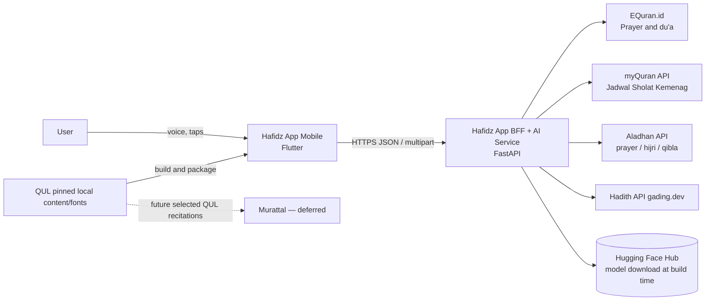
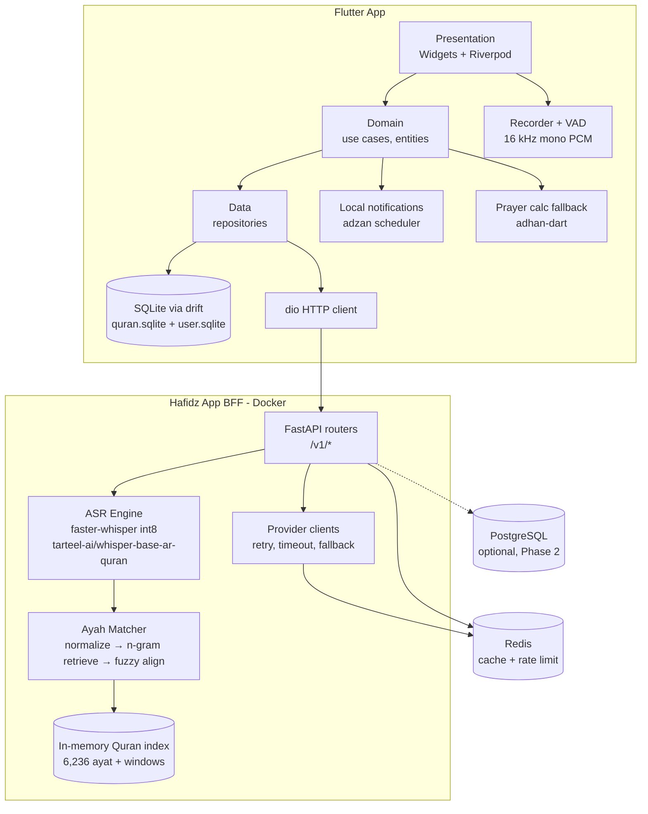
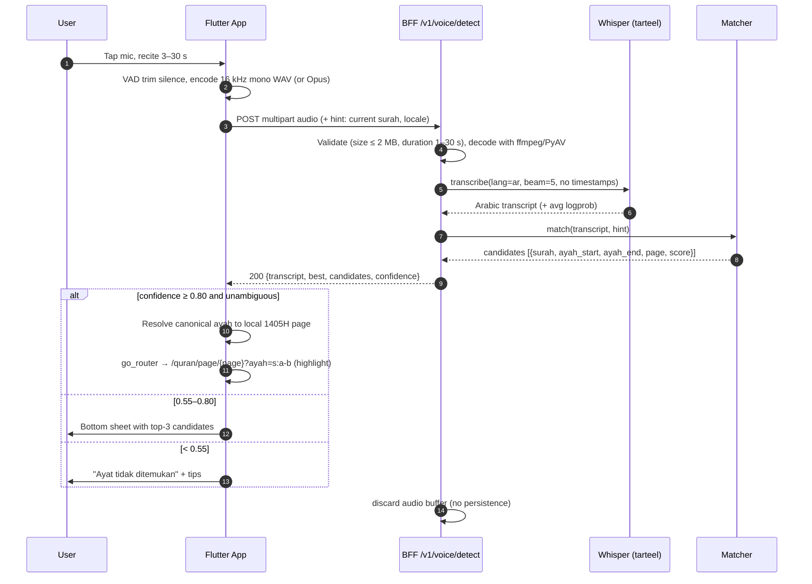
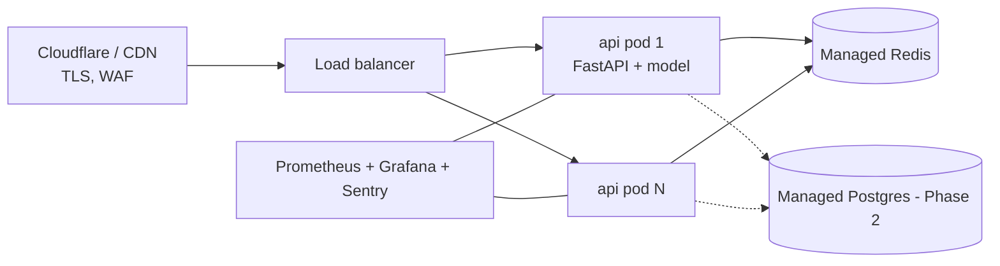

# 02 — System Architecture

**Current target:** [docs/12](12-QUL-CORE-AND-LIVE-VOICE.md) supersedes legacy Qur'an provider arrows and the one-shot-only flow below. QUL is the sole Qur'an content/build source; the Tarteel ASR model remains separate. Live follow adds a bounded WebSocket service and stable canonical ayah events.

## 1. Architectural style

- **Offline-first mobile client** with a bundled Qur'an database.
- **Backend-for-Frontend (BFF)** in FastAPI that (a) hosts the ASR + ayah-matching AI service, (b) proxies and caches
  third-party Islamic APIs, (c) hides secrets (external-provider credentials).
- Stateless services, horizontally scalable; Redis for cache and rate limiting.

## 2. Context diagram (C4 level 1)

Audio files are streamed **directly** from public CDNs by the client (no secrets, large payloads) — the BFF only returns
URLs/metadata.

## 3. Container diagram (C4 level 2)

## 4. Key runtime flow — Voice Ayah Finder

## 5. Tech stack & rationale

| Layer | Choice | Why | ADR |
|---|---|---|---|
| Mobile | Flutter 3 + Riverpod + go_router + drift | One codebase, strong RTL/Arabic text rendering, good audio & sensor plugins | ADR-001 |
| AI serving | faster-whisper (CTranslate2) int8 on CPU | 3–4× faster than PyTorch on CPU for Whisper; base model is small enough for CPU pods | ADR-002 |
| Matching | Custom n-gram + rapidfuzz alignment over bundled Qur'an | Deterministic, explainable, no extra model; handles ASR errors | ADR-003 |
| BFF | FastAPI + Pydantic v2 | Python shares runtime with ASR; OpenAPI auto-generated | ADR-002 |
| Cache | Redis | TTL cache for provider responses, token cache, rate limit | — |
| Offline Qur'an | Pinned QUL SQLite (Uthmani, metadata, Indonesian translation) | Offline-first, fast navigation, deterministic page mapping | ADR-004 |
| Mushaf presentation (planned) | QUL 1405H fixed lines + V1 word glyphs + matching page fonts | Reproduce the selected print with pressable ayat; preserve canonical text separately | ADR-006 |
| Prayer (ID) | equran.id / myQuran (Kemenag) + on-device `adhan` calc fallback (KEMENAG params) | Official Indonesian schedule; works offline | ADR-005 |

### 5.1 Madinah 1405H presentation layer (planned)

The T-M04 paragraph renderer is a prototype awaiting replacement. The proposed inputs are QUL layout resource
15, word-glyph resource 57, and font resource 238; see [the source audit and plan](11-MUSHAF-1405H-REDESIGN.md).
QUL is a build-time download source, with no runtime dependency for reading.

The mobile content DB v2 will add edition, asset, page, line, and word records beside unchanged canonical ayat
(docs/06 §1.1). A fixed-page renderer shapes the source's prescribed lines with the exact page font. It derives
word bounds from that shaped output and groups them by canonical ayah for touch targets and highlight segments.
Drawing and hit testing share the page-fit/zoom transform; no upstream pixel-coordinate package is assumed.

Navigation from voice, search, or bookmarks resolves `surah:ayah` through the local 1405H mapping. Existing API
`page` fields and server index assets remain compatible; they do not override this edition's mapping. The list
reader, ASR matcher, clipboard, and accessibility labels continue using canonical text, never glyph encodings.

Install the validated DB and matching font/layout package together. Preserve `user.sqlite` and fail visibly on
missing or mismatched assets. Bundle complete offline coverage, with a bounded font/geometry cache; measure
actual download size, installed size, and memory before resolving the provisional 60 MB budget. Exact resource
schemas, licenses, auxiliary artwork, and visual fidelity are validation gates, not completed work.

See [ADR-006](adr/ADR-006-madinah-1405h-mushaf.md) for the decision and alternatives.

## 6. Deployment

- Container image bakes the converted CTranslate2 model (`/models/whisper-base-ar-quran-ct2-int8`, ~75 MB) and the
  prebuilt Qur'an index (`/data/quran_index.pkl`), so pods start without network access to HF.
- Sizing (starting point): 2 vCPU / 2 GB RAM per pod, `WEB_CONCURRENCY=1`, ASR thread pool = 2 workers per pod
  (`cpu_threads=1` each). Scale on CPU > 60 % or p95 latency > 1.5 s.
- GPU is **not** required for whisper-base; add a GPU pool only if migrating to larger Tarteel models.
- Environments: `dev` (docker-compose), `staging`, `prod`; content and fonts come from pinned local QUL resources.

## 7. Cross-cutting concerns

| Concern | Approach |
|---|---|
| Config | 12-factor env vars; `.env.example` in repo; pydantic-settings |
| Secrets | Secret manager (Doppler / GCP Secret Manager / AWS SM); never in the app binary |
| Observability | Structured JSON logs (no transcripts in logs at INFO; never audio), Prometheus metrics: `asr_latency_seconds`, `match_confidence`, `provider_errors_total{provider}`, and voice request counts/latency; Sentry for app + API |
| Rate limiting | `/v1/voice/detect`: 10 req/min per device id + 200/day; others 120 req/min |
| Caching | Surah/ayah content: 30 d; prayer schedule: until end of month; hadith: 7 d; QF token: until `expires_in − 60 s` |
| Resilience | Provider clients: timeout 8 s, 2 retries (429/5xx, backoff 0.5 s·2^n + jitter), circuit breaker (5 failures / 30 s), fallback chain (docs/04 §9) |
| API versioning | Path prefix `/v1`; breaking changes → `/v2` |
| Device identity | Anonymous `X-Device-Id` (UUID v4 generated on first launch) for rate limiting only |

## 8. Phase-2 option: on-device inference

To remove network dependency and server cost, port the model on-device:
- **whisper.cpp** (GGML): convert the HF checkpoint with `models/convert-h5-to-ggml.py`, quantize to q5_0/q8_0
  (~50–80 MB), use a Flutter FFI plugin.
- **sherpa-onnx**: export encoder/decoder ONNX (int8) via its `scripts/whisper/export-onnx.py` pattern.
- Matching index (~5 MB) is already bundled on device → the same Dart port of the matcher runs offline.
- Validate on the golden set before switching (quantization can reduce accuracy; see docs/09).
The server path stays as fallback for low-end devices.
