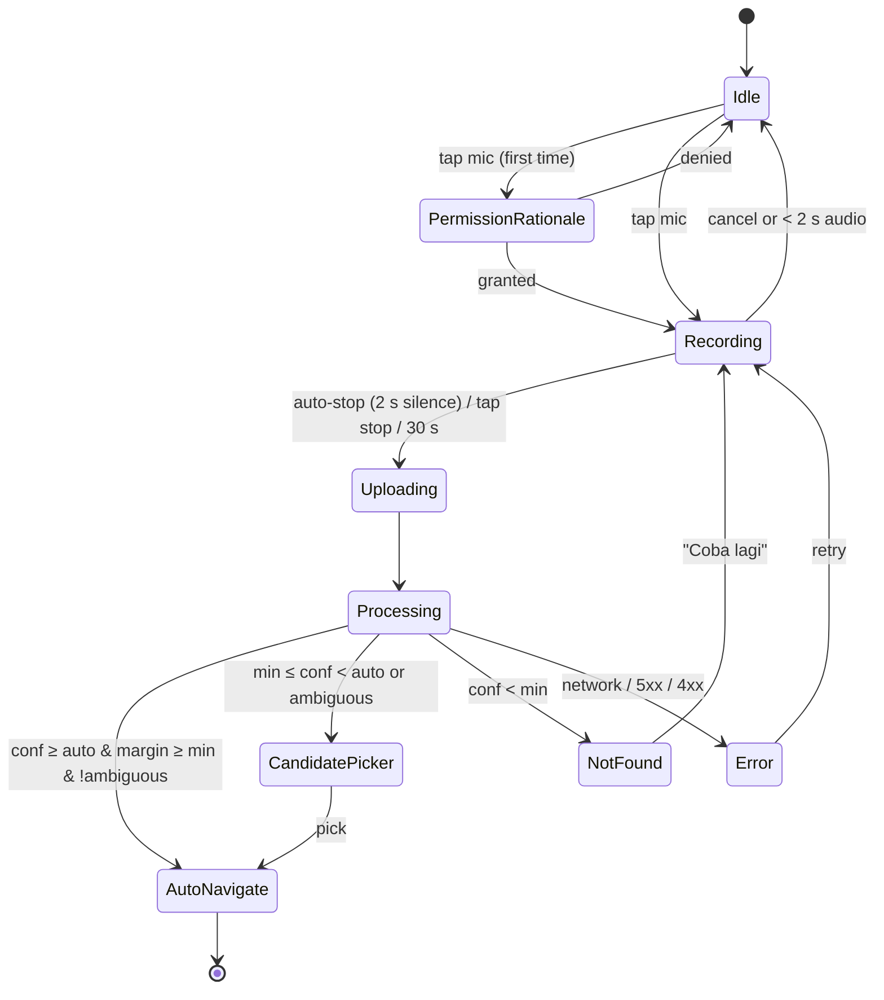

# 07 — Mobile App Design (Flutter)

## 1. Information architecture

Bottom navigation (5 tabs):

| Tab | Route | Content |
|---|---|---|
| Beranda (Home) | `/` | Next-prayer countdown card, Hijri + Gregorian date, **Voice Ayah Finder big mic button**, last read, ayat of the day, quick tiles (Qibla, Doa, Tasbih, Hadith, Asmaul Husna) |
| Al-Qur'an | `/quran` | Surah / Juz / Bookmarks tabs; search; mic FAB |
| Sholat | `/prayer` | Today's times, month view, adzan settings, location |
| Kiblat | `/qibla` | Compass |
| Lainnya (More) | `/more` | Doa, Hadith, Asmaul Husna, Tasbih, Hijri calendar, Settings, About & Attribution |

## 2. Routes & deep links (go_router)

| Route | Screen | Notes |
|---|---|---|
| `/quran/surah/:n?ayah=:a` | List reader | Scrolls to ayah |
| `/quran/page/:p?ayah=:s::a[-:b]&hl=1` | Mushaf reader | `hl=1` → highlight animation (Voice Ayah Finder target) |
| `/quran/ayah/:key` | Resolves to page route via DB (`key` = `2:255`) | Used by share links |
| `/voice` | Voice Ayah Finder (full-screen modal) | |
| `/voice/result` | Candidate picker (bottom sheet route) | |
| `/prayer/month` , `/prayer/settings` , `/prayer/location` | | |
| `/doa` , `/doa/:id` , `/hadith` , `/hadith/:book` , `/hadith/:book/:n` , `/asmaul-husna` , `/tasbih` , `/hijri` , `/settings` , `/about` | | |

External deep links: scheme `hafidz://` and App Links / Universal Links `https://example.com/q/2:255` (replace with the owned app domain before release).
Android intent filter for `ACTION_SEND` `audio/*` → `/voice?shared=1` (US-01.2).

## 3. Voice Ayah Finder — UX flow & states



Screen specs:

| State | UI |
|---|---|
| Recording | Full-screen dark overlay, pulsing mic, live waveform (amplitude stream from `record`), timer `00:07 / 00:30`, hint text "Bacakan ayat dengan jelas (5–15 detik)", buttons: Batal / Selesai |
| Processing | Shimmer + "Mencari ayat…", cancel button; show progress steps (Mengunggah → Mengenali → Mencocokkan) |
| AutoNavigate | Close overlay → Mushaf page; highlighted ayah with 4 s pulse (primary color 20 % opacity), snackbar "QS Al-Baqarah: 255 · Juz 3 · Hal. 42" with actions **Putar** (play murottal from that ayah) and **Bukan ini?** (opens candidate picker) |
| CandidatePicker | Bottom sheet: title "Mungkin maksud Anda:"; up to 3 cards: surah Latin + number, ayah range, Arabic snippet (first 8 words, RTL), translation snippet, score bar; "Rekam ulang" button; if `reason == identical_ayat` show note "Ayat ini diulang di beberapa tempat" |
| NotFound | Illustration, "Ayat tidak ditemukan", tips list, "Coba lagi" |
| Transcript | Collapsible "Yang terdengar:" with ASR text (RTL) in all result states |

Provider wiring (Riverpod):

```dart
final voiceControllerProvider = NotifierProvider.autoDispose<VoiceController, VoiceState>(VoiceController.new);

sealed class VoiceState { const VoiceState(); }
class VoiceIdle extends VoiceState { const VoiceIdle(); }
class VoiceRecording extends VoiceState { final Duration elapsed; final double amplitude; const VoiceRecording(this.elapsed, this.amplitude); }
class VoiceProcessing extends VoiceState { final VoiceStep step; const VoiceProcessing(this.step); }
class VoiceResult extends VoiceState { final VoiceDetectResult result; final VoiceDecision decision; const VoiceResult(this.result, this.decision); }
class VoiceFailure extends VoiceState { final AppError error; const VoiceFailure(this.error); }
```

`VoiceController`:
1. `start()` → check/request mic permission → `AudioRecorder.start(RecordConfig(encoder: AudioEncoder.wav, sampleRate: 16000, numChannels: 1))`.
2. Listen `onAmplitudeChanged(Duration(milliseconds: 100))` → VAD (silence when `current < -45 dBFS` for 2 s after ≥ 2 s speech).
3. `stop()` → file path → `VoiceRepository.detect(file, hintSurah)` → `decide()` → emit `VoiceResult`.
4. `finally` delete temp file.
5. On `autoNavigate`: `context.go('/quran/page/${m.page}?ayah=${m.range.key}&hl=1')`, insert history row.

## 4. Qur'an reader

- **Mushaf mode:** `PageView` reversed (RTL), 604 pages. Rendering options:
  - v1: text-based page layout from DB (`page` → ayat) with Uthmani font (KFGQPC HAFS / Amiri Quran), justified RTL,
    ayah end markers `۝` with Arabic-Indic numerals, surah header + basmala blocks.
  - v2: glyph-accurate Madani layout using Quran Foundation V1/V2 glyph codes + per-page QCF fonts (downloaded on demand).
- **Highlight API:** `ReaderController.highlight(AyahRange range, {Duration pulse = 4s})` — used by voice, audio
  follow-along, and search.
- **List mode:** `ScrollablePositionedList` per surah; each item: Arabic (RTL), Latin (toggle), translation (toggle),
  actions (play, bookmark, share, copy, tafsir).
- Long-press ayah → action sheet. Auto-save reading position on page change (debounced 1 s).

## 5. Murottal player

- `just_audio` + `audio_service` for background & lock-screen controls.
- Playlist = per-ayah URLs from reciter template (docs/05 §2.2) → exact ayah highlighting via `currentIndexStream`.
- Modes: single ayah, range, surah, repeat-N (hafalan), continuous to next surah.
- Offline: download surah files into `audio_download`; player prefers local file.

## 6. Prayer times & adzan

- Location: `geolocator` → `/v1/prayer/locations/reverse` (or offline nearest from `prayer_location` table using haversine).
- Fetch 2 months → `prayer_cache`. If network fails → `adhan` Dart package with KEMENAG params
  (Fajr 20°, Isha 18°, Shafi'i Asr, + ihtiyat) → `source = calc`.
- Scheduling: `flutter_local_notifications.zonedSchedule` with `AndroidScheduleMode.exactAllowWhileIdle`; request
  `SCHEDULE_EXACT_ALARM` / `USE_EXACT_ALARM` rationale; reschedule on boot (`RECEIVE_BOOT_COMPLETED`), on location change,
  and daily at 00:05 via `workmanager`. iOS: max 64 pending notifications → schedule the next 7 days only.
- Custom adzan sounds bundled (`res/raw` Android, `.caf` iOS, ≤ 30 s for iOS).

## 7. Qibla

- Bearing computed locally: `θ = atan2(sin Δλ · cos φk, cos φ · sin φk − sin φ · cos φk · cos Δλ)` with Kaaba
  (21.4225, 39.8262). Compass heading from `flutter_compass`; show accuracy warning + figure-8 calibration animation.
- Correct for magnetic declination (`geomag` model or `flutter_compass` true-heading where available).

## 8. Design system

| Token | Value |
|---|---|
| Primary | Emerald `#0F766E` (light) / `#2DD4BF` (dark) |
| Accent | Gold `#B08D57` |
| Surfaces | Light `#FAFAF7`, Sepia `#F5EEDC`, Dark `#0B1416` |
| Arabic font | KFGQPC Uthmanic Script HAFS (fallback Amiri Quran), default 28 sp, range 20–44 |
| Latin font | Inter / Plus Jakarta Sans |
| Radius | 16 cards, 28 sheets |
| Motion | 200 ms standard, 4 s highlight pulse |

All Arabic widgets: `Directionality(textDirection: TextDirection.rtl)`, `textAlign: TextAlign.justify` in Mushaf mode.

## 9. i18n

`flutter_localizations` + ARB files `app_id.arb` (default), `app_en.arb`. Never hardcode UI strings. Surah names:
Latin + Indonesian meaning from DB, not ARB.

## 10. Permissions

| Permission | Why | When requested |
|---|---|---|
| Microphone | Voice Ayah Finder | First mic tap, after rationale screen |
| Location (when in use) | Prayer times, qibla | Onboarding step 2 (skippable → manual city) |
| Notifications (Android 13+ / iOS) | Adzan | Onboarding step 3 |
| Exact alarms (Android 12+) | On-time adzan | When enabling adzan |

## 11. Onboarding (3 steps)

1. Language (Bahasa Indonesia / English).
2. Location (GPS or pick city) → shows today's schedule preview.
3. Notifications & adzan preference → Home.
